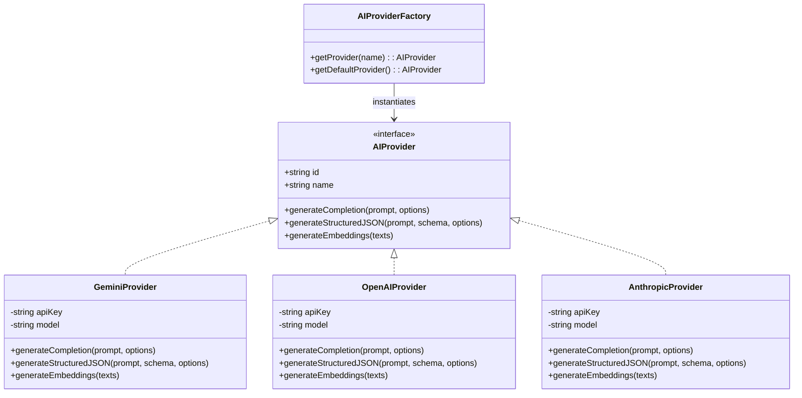
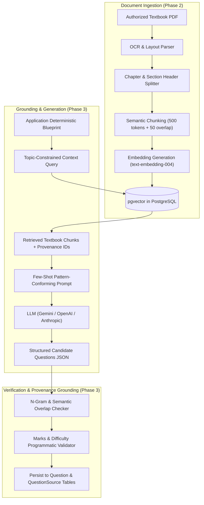

# Multi-Provider AI Pipeline & Ingestion Architecture

This document describes the future AI processing pipeline (designed in Phase 1, implemented in Phases 2 & 3), outlining the provider-agnostic adapter layer, document ingestion and vectorization, RAG retrieval mechanics, and book-grounded generation safeguards.

---

## 1. Provider-Agnostic Adapter Pattern

The platform interacts with Large Language Models exclusively through the `AIProvider` contract located at `lib/ai/types.ts`. This design prevents vendor lock-in and enables seamless switching between providers via configuration.

---

## 2. Ingestion & RAG Pipeline (Future Phases)

---

## 3. Strict Boundary Rules

1. **No Mathematical Calculation by LLM**:
   - The LLM must **never** be tasked with calculating sum of marks, question counts, or difficulty ratios.
   - The deterministic blueprint engine provides the exact integer targets (e.g., generate exactly 1 MCQ of difficulty EASY, worth 1 mark, from Chapter 2 Topic 3).
2. **Mandatory Source Quotation**:
   - For every question generated, the LLM must provide the direct text quotation from the supplied chunk that substantiates both the question and the answer key.
3. **Structured Outputs Only**:
   - All completions must strictly adhere to strongly-typed Zod schemas passed into the provider's structured output mode (e.g., Gemini `response_schema`).
4. **Safety & Toxicity Filters**:
   - Educational content filters are enforced at the provider level, blocking hate speech, dangerous content, or unverified claims.
