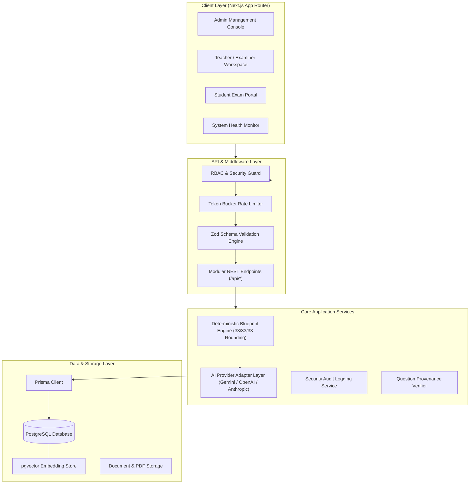
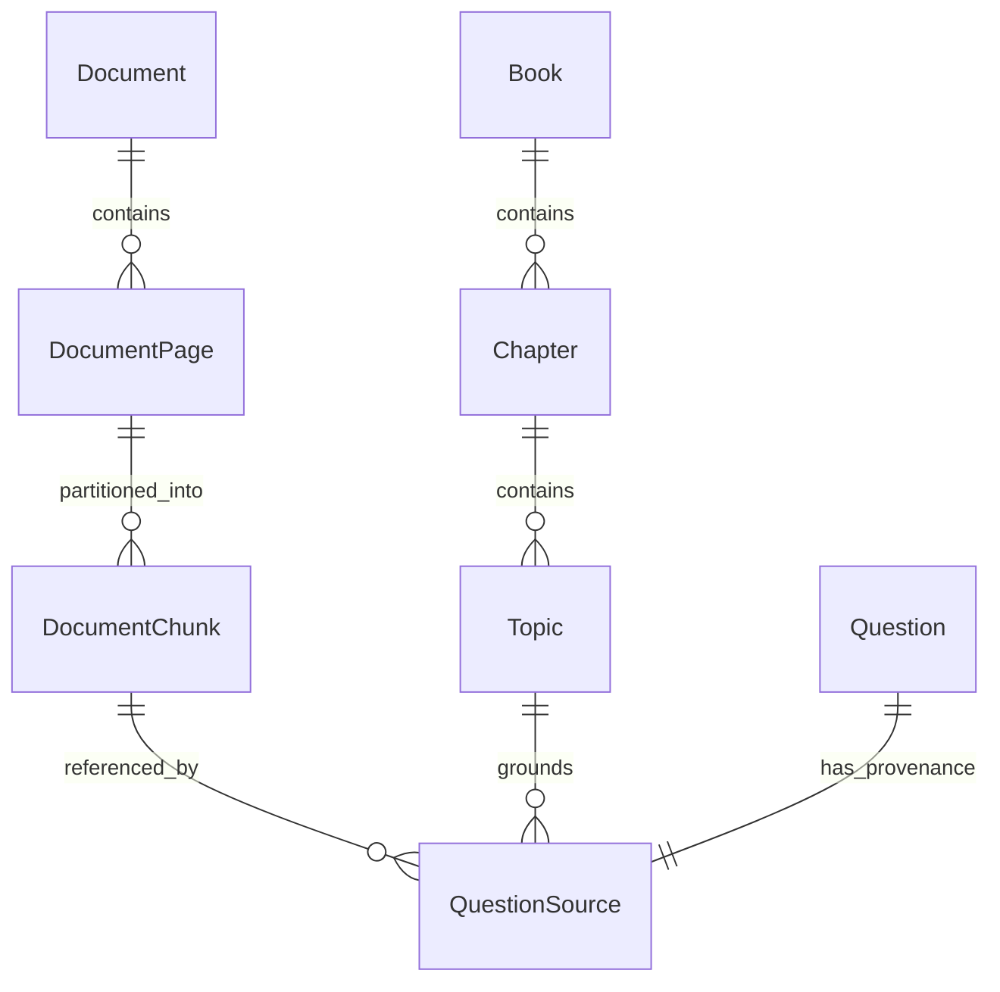

# System Architecture: AI Live Paper Generator

## 1. High-Level Architecture Overview

The **AI Live Paper Generator** is a multi-tier, modular enterprise educational platform engineered to generate curriculum-aligned, high-integrity examination papers. The system is architected around strict separation between **stochastic generative operations** (LLM question generation and rubric drafting) and **deterministic validation operations** (total marks calculation, question counts, difficulty distributions, and choice constraints).



---

## 2. Educational & Examination Hierarchies

### 2.1 Educational Hierarchy
The curriculum hierarchy is modeled dynamically to prevent hard-coding any specific board (such as the Punjab Board, Federal Board, Cambridge, or CBSE). The hierarchy flows strictly through normalized relationships:

$$\text{Board} \longrightarrow \text{Academic Year} \longrightarrow \text{Class} \longrightarrow \text{Subject} \longrightarrow \text{Book} \longrightarrow \text{Chapter} \longrightarrow \text{Topic}$$

- **Board**: Independent jurisdiction/educational board (e.g. BISE Lahore, Federal Board, Edexcel).
- **AcademicYear**: Temporal syllabus binding (e.g., 2024-2025).
- **Class**: Educational tier/grade level (e.g., Grade 9, Grade 10, Intermediate Part 1).
- **Subject**: Specific academic discipline (e.g., Physics, Computer Science).
- **Book**: Authorized textbook volume linked to an ISBN/edition.
- **Chapter**: Units of study within an authorized book.
- **Topic**: Granular concepts mapped to official Student Learning Outcomes (SLOs).

### 2.2 Examination Hierarchy
The assessment schema supports standardized paper blueprints derived from past papers and board patterns:

$$\text{Sample Paper} \longrightarrow \text{Paper Pattern} \longrightarrow \text{Paper Section} \longrightarrow \text{Question Type} \longrightarrow \text{Question} \longrightarrow \text{Marks} \longrightarrow \text{Difficulty}$$

Supported Question Types:
- `MULTIPLE_CHOICE` (MCQ)
- `SHORT_QUESTION`
- `LONG_QUESTION`
- `NUMERICAL`
- `CONCEPTUAL`
- `DEFINITION`
- `EXPLANATION`
- `COMPARISON`
- `APPLICATION_BASED`
- `DIAGRAM_BASED`

---

## 3. Deterministic Blueprinting Engine

### 3.1 The 33% Difficulty Allocation Rule
In high-stakes educational examinations, difficulty must be evenly and reproducibly distributed:
- **Easy**: ~33.33%
- **Medium**: ~33.33%
- **Difficult**: ~33.33%

Because question counts are discrete integers (e.g., 10 questions, 17 questions, 75 marks), floating-point allocations cannot simply be rounded independently without risking mismatches where $\sum \text{counts} \neq N$.

### 3.2 Programmatic Integer Rounding Algorithm
The application runtime implements the Largest Remainder (Hare-Niemeyer) method:
1. Let $N$ be the total target question count.
2. Calculate target proportions: $T_{easy} = N \times \frac{1}{3}$, $T_{med} = N \times \frac{1}{3}$, $T_{diff} = N \times \frac{1}{3}$.
3. Take integer floors: $F_{easy} = \lfloor T_{easy} \rfloor$, $F_{med} = \lfloor T_{med} \rfloor$, $F_{diff} = \lfloor T_{diff} \rfloor$.
4. Determine remaining questions: $R = N - (F_{easy} + F_{med} + F_{diff})$.
5. Allocate remainder points deterministically to categories based on sorted fractional remainders with a standardized tie-breaking priority (`MEDIUM` $\to$ `EASY` $\to$ `DIFFICULT`).

$$\sum (C_{easy} + C_{med} + C_{diff}) \equiv N \quad \forall N \in \mathbb{N}$$

> **Architectural Law**: The LLM is **never** permitted to calculate or determine total marks, total question counts, or section sums. The application runtime calculates the deterministic blueprint and tasks the LLM only with generating individual candidate questions conforming to exact constraints.

---

## 4. Book Knowledge Architecture & Question Provenance

To guarantee zero hallucination, every generated assessment item is inextricably bound to an authorized educational source.



### 4.1 Provenance Metadata Record
Every question record in the database maintains the following cryptographic and relational provenance trace:
- `sourceDocumentId`: Unique ID of the authorized textbook PDF.
- `bookId`: Authorized textbook reference.
- `chapterId` & `topicId`: Specific curriculum node.
- `pageNumber`: Physical page in the textbook.
- `sourceChunkIds`: Array of specific chunk UUIDs passed in the prompt context.
- `generationModel`: Exact model identifier (e.g. `gemini-1.5-pro`).
- `generationTimestamp`: UTC ISO timestamp of generation.
- `difficulty`: Validated difficulty level (`EASY`, `MEDIUM`, `DIFFICULT`).
- `validationStatus`: Machine verification and human SME review state (`PENDING`, `VERIFIED`, `REJECTED`).

---

## 5. Provider-Agnostic AI Integration Layer

The platform isolates AI interactions through a clean adapter interface (`lib/ai/types.ts`). The business logic interacts solely with an abstract `AIProvider` contract.

```typescript
export interface AIProvider {
  readonly id: string;
  readonly name: string;
  generateCompletion(prompt: PromptPayload, options?: ModelOptions): Promise<AICompletionResponse>;
  generateStructuredJSON<T>(prompt: PromptPayload, schema: z.ZodSchema<T>, options?: ModelOptions): Promise<T>;
  generateEmbeddings(texts: string[]): Promise<number[][]>;
}
```

- **Default Provider**: Google Gemini (`@google/genai` or REST API) leveraging large context windows and structured JSON schema output.
- **Pluggable Providers**: OpenAI, Anthropic, or local open-weights models (via vLLM/Ollama) can be introduced by implementing `AIProvider` without altering core services.

---

## 6. Security Architecture

1. **Defense in Depth**: Next.js server actions and API route handlers guard against unauthorized access using centralized RBAC middleware.
2. **Server-Side API Key Protection**: AI provider keys (`GEMINI_API_KEY`, `OPENAI_API_KEY`) reside exclusively in server runtime memory and are strictly forbidden from client bundles (`NEXT_PUBLIC_` prefix disallowed).
3. **Comprehensive Audit Logging**: Sensitive operations (blueprint generation, paper release, role modification, exam submission) are persisted to the `AuditLog` table with actor ID, IP address, user agent, and contextual payload metadata.
4. **Rate Limiting**: Sliding token bucket middleware throttles malicious or runaway API invocation per client IP and authenticated session.
