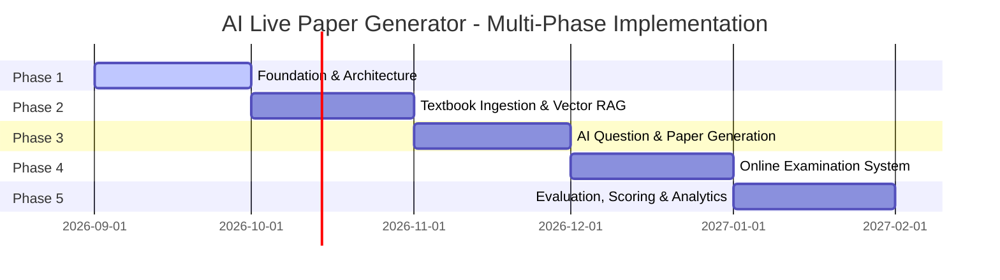

# Development Phases & Multi-Milestone Roadmap

This document outlines the phased roadmap for building the **AI Live Paper Generator** from inception to full production maturity. In strict adherence to development instructions, work is partitioned across distinct phases.

---

## 🗺️ Master Roadmap Overview

---

## 📍 Phase 1: Foundation & Architecture (CURRENT PHASE)
**Objective**: Build the core system architecture, data models, AI provider interface, deterministic calculation engine, and security perimeter.

### Scope & Deliverables
- [x] Project workspace initialization (Next.js 15, TypeScript, Tailwind CSS, Prisma, Zod, Vitest).
- [x] Educational and examination domain models in Prisma schema (22+ entities, pgvector ready).
- [x] Provider-agnostic AI abstraction layer (`lib/ai/types.ts`, `gemini-provider.ts`, `factory.ts`).
- [x] Deterministic Blueprint Calculation Engine enforcing 33/33/33 integer rounding and marks validation.
- [x] Security architecture (RBAC, audit logging service, rate limiting, server-side secrets).
- [x] API route handlers foundation (`/api/health`, `/api/boards`, `/api/papers`, etc.).
- [x] Responsive frontend shell with landing page, dashboards, and live health monitor.
- [x] Comprehensive documentation (8 core architecture files).
- [x] Unit, integration, schema validation, and type tests.

> ⛔ **Strict Exclusion**: No textbook ingestion, OCR, embeddings, RAG, AI question generation, online examination, or result calculation in Phase 1.

---

## 📍 Phase 2: Textbook Ingestion, OCR & Vector Knowledge Base
**Objective**: Ingest authorized textbook PDFs, extract layout/text/diagrams, chunk semantically, generate vector embeddings, and store them in PostgreSQL with pgvector.

### Scope & Deliverables
- PDF layout parsing and OCR pipeline for English, Urdu, and bilingual documents.
- Chapter and topic extraction aligned with official board curriculum.
- Chunking engine preserving mathematical equations (LaTeX) and diagram references.
- Integration with Google Gemini `text-embedding-004` (or OpenAI `text-embedding-3-small`).
- pgvector HNSW indexing and semantic similarity search endpoints.
- Textbook and document management admin UI.

---

## 📍 Phase 3: AI Question Generation & Deterministic Paper Assembly
**Objective**: Generate curriculum-grounded questions conforming to board patterns and assemble complete examination papers according to deterministic blueprints.

### Scope & Deliverables
- Few-shot structured prompt engineering for all 10 question types:
  - MCQ, Short Question, Long Question, Numerical, Conceptual, Definition, Explanation, Comparison, Application-Based, Diagram-Based.
- Grounding engine: retrieval of relevant chunks, quotation matching, and hallucination prevention.
- Question provenance record creation (`QuestionSource`).
- Paper generation orchestrator: querying blueprint, selecting candidate items, verifying difficulty quotas.
- Examiner review, edit, and paper publication workflows.
- Export to high-resolution print PDF and printable examination layouts.

---

## 📍 Phase 4: Online Student Examination Portal
**Objective**: Enable students to securely attempt generated papers online with strict timing and anti-cheating measures.

### Scope & Deliverables
- Secure, timed student exam execution interface.
- Autosave mechanics (local client storage + debounced background sync).
- Section-by-section navigation with choice rules enforcement (e.g., "Attempt any 5 of 8").
- Diagram viewing, scratchpad, and equation editor support for numerical questions.
- Anti-tampering controls: full-screen enforcement, blur detection, and connection loss recovery.

---

## 📍 Phase 5: Automated Evaluation, Scoring & Analytics
**Objective**: Automatically evaluate objective questions, evaluate subjective answers using book-grounded rubrics, and deliver detailed diagnostic results.

### Scope & Deliverables
- Immediate deterministic scoring for MCQs and objective items.
- AI rubric-based grading for short and long subjective answers grounded in textbook answer keys.
- Step-by-step marks attribution for numerical problems.
- Comprehensive result scorecard generation (percentage, grade, topic strengths/weaknesses).
- Cohort and school-wide performance analytics dashboards.
